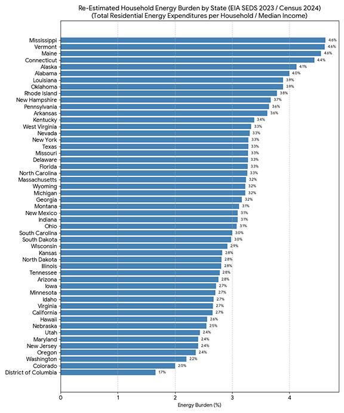
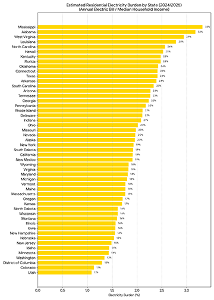
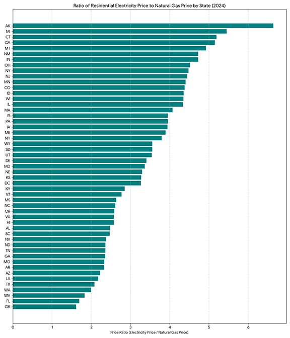

Key demand-side snapshots and trends for the US energy sector.

* TOC
{:toc}

# Affordability

*Where are Americans spending the most amount of their money on energy?*

 

*Which states (by major city) have the highest construction costs?*

*What are the key drivers of new building construction costs?*

# Technology Choice

*Where do prices for electricity and fossil fuels differ the most across the country?*

*What are the latest trends in building heating equipment sales?*

*How frequently do consumers replace their heating equipment?*

# Load Growth

*Where are electric loads from buildings growing the fastest across the country?*

*How does load growth in buildings breakdown across end-use sources (including data centers vs. other loads)?*

# Grid Edge

*What are the latest trends in T&D investment?*

*What are the latest trends in behind-the-meter technology costs and deployment?*

# Economic Growth and Competitiveness

*What portion of GDP is attributable to activities in the buildings sector?*

*Globally, what are the fastest-growing markets for building technologies?*

*How many jobs are associated with building design, construction, operation, and retrofits, and what are the recent trends in these job markets?*